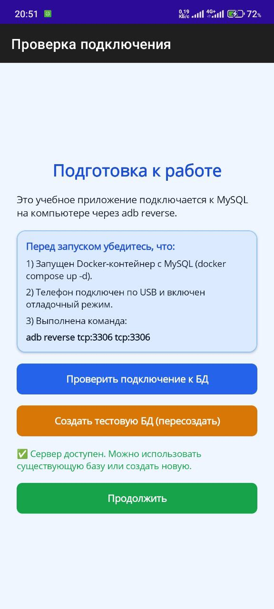
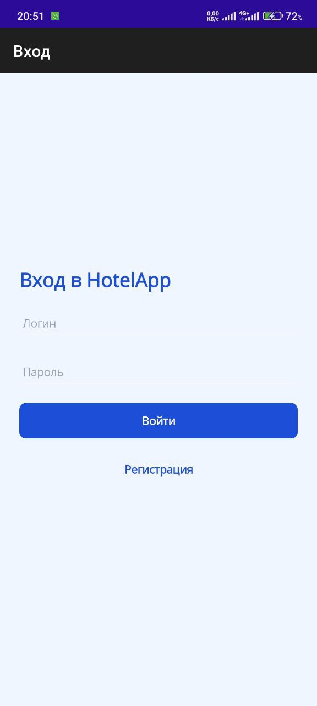
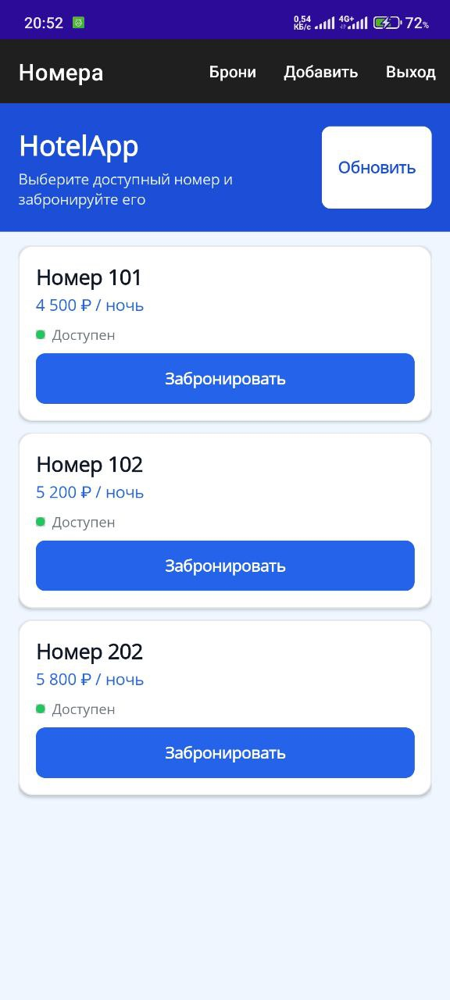
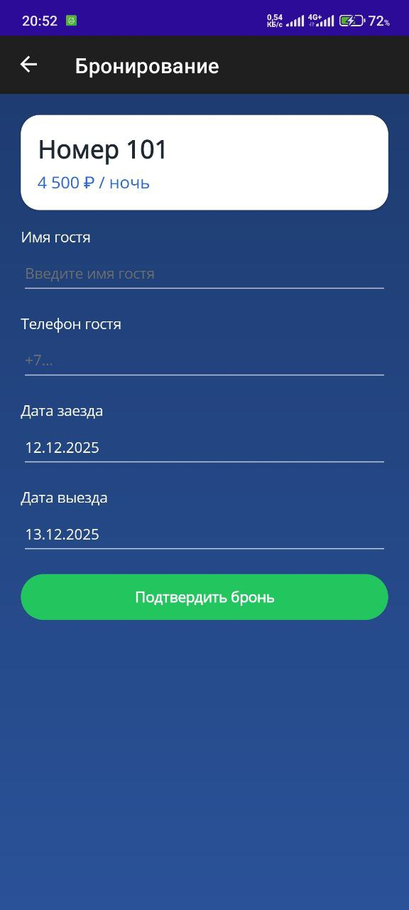
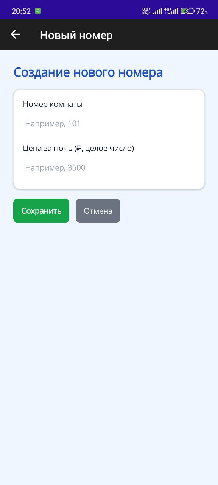

# HotelAppLocal — учебное приложение для бронирования номеров (MAUI + MySQL)

**HotelAppLocal** — это учебное .NET MAUI-приложение для бронирования гостиничных номеров с ролями:

- **Admin** — администратор системы;
- **Registrar** — регистратор бронирований;
- **User** — обычный пользователь.

Бэкенд — **MySQL** (Docker), подключение с Android-устройства — через `adb reverse`.

Приложение демонстрирует:

- работу MAUI-клиента с внешней БД (MySQL) через EF Core;
- стартовый экран с проверкой подключения к БД и инициализацией тестовых данных;
- авторизацию и роли;
- бронирование номеров;
- управление бронированиями (подтверждение / отмена);
- просмотр «Моих бронирований» для обычного пользователя;
- создание новых номеров администратором.

<p align="center">
  
  
  
  
  
</p>


---

## 1. Архитектура и основные сущности

### 1.1. Сущности базы данных

В БД используются три ключевые сущности:

- **Users** — пользователи:
  - `Id`, `UserName`, `PasswordHash`, `Role` (`UserRole`);
- **Rooms** — номера:
  - `Id`, `Number` (строка, например `"101"`), `PricePerNight` (int), `IsAvailable`;
- **Bookings** — бронирования:

```csharp
public class Booking
{
    public int Id { get; set; }

    public int RoomId { get; set; }
    public Room Room { get; set; } = null!;

    public string GuestName { get; set; } = null!;
    public string GuestPhone { get; set; } = null!;

    public DateTime FromDate { get; set; }
    public DateTime ToDate { get; set; }

    public BookingStatus Status { get; set; } = BookingStatus.Pending;

    /// <summary>Кем создана бронь (пользователь системы).</summary>
    public int? CreatedByUserId { get; set; }
    public User? CreatedByUser { get; set; }

    /// <summary>Кем подтверждена/отменена.</summary>
    public int? HandledByUserId { get; set; }
    public User? HandledByUser { get; set; }
}
```

Enum статуса:

```csharp
public enum BookingStatus
{
    Pending = 0,   // ожидает подтверждения
    Confirmed = 1, // подтверждена
    Cancelled = 2  // отменена
}
```

### 1.2. Роли пользователей

```csharp
public enum UserRole
{
    User = 0,      // обычный пользователь
    Admin = 1,     // администратор
    Registrar = 2  // регистратор (администратор бронирований)
}
```

---

## 2. Известные аккаунты (тестовые логины)

По умолчанию (если не меняли `DbInitializer`) в базу добавляются тестовые пользователи:

| Роль       | Логин       | Пароль      | Описание                                                |
|-----------|-------------|-------------|---------------------------------------------------------|
| Admin     | `admin`     | `admin`     | Полные права: создание номеров, управление бронированиями |
| Registrar | `registrar` | `registrar` | Может подтверждать/отменять бронирования               |
| User      | `user`      | `user`      | Обычный пользователь, бронирует и просматривает свои брони |

> Если вы меняли `DbInitializer`, проверьте там реальные логины и пароли.

---

## 3. Основные экраны и логика

### 3.1. StartupPage — стартовый экран проверки БД

Первый экран, который видит пользователь.

Функции:

- Инструкция:
  - запустить MySQL в Docker;
  - при запуске на Android-устройстве выполнить `adb reverse tcp:3306 tcp:3306`.
- **«Проверить подключение к БД»**:
  - вызывает `DbHealthService.CheckPortAsync()` и проверяет доступность `host:port`;
  - если порт доступен — зелёный статус, **«Продолжить»** становится активной;
  - во время проверки показывается `ActivityIndicator`, кнопки блокируются.
- **«Создать тестовую БД (пересоздать)»**:
  - вызывает `DbHealthService.InitializeTestDatabaseAsync()`;
  - внутри `DbInitializer.Initialize(AppDbContext db)`:
    - пересоздаёт схему;
    - наполняет тестовыми данными (пользователи, номера).
- **«Продолжить»**:
  - доступна только если проверка/инициализация прошла успешно;
  - переключает `MainPage` на `LoginPage`.

### 3.2. LoginPage / RegistrationPage

**LoginPage:**

- Ввод логина и пароля.
- `AuthService.LoginAsync(userName, password)`:
  - ищет пользователя в базе;
  - при успехе записывает в `AuthService.CurrentUser`.
- При успешном входе:
  - `Application.Current.MainPage = new NavigationPage(roomsPage);`

**RegistrationPage** (если включена):

- Создаёт нового пользователя с ролью `User`.

### 3.3. RoomsPage — список номеров

Основной экран после входа:

- Показывает список номеров (через `RoomsViewModel.LoadCommand`).
- Для каждого номера:
  - `Number` — текст «Номер ХХХ»;
  - `PricePerNight` — «₽ / ночь»;
  - кнопка **«Забронировать»**, открывающая `BookingPage`.

В Toolbar:

- **«Брони»**:
  - доступна всем залогиненным пользователям;
  - логика:
    - если `Role == Admin` или `Role == Registrar` → открывается `BookingsManagementPage` (управление всеми бронированиями);
    - иначе → открывается `MyBookingsPage` (личные бронирования текущего пользователя).
- **«Добавить»**:
  - только для `Role == Admin`;
  - открывает `NewRoomPage`, где можно создать новый номер.
- **«Выход»**:
  - вызывает `auth.Logout()` и возвращает пользователя на `LoginPage`.

### 3.4. BookingPage — создание брони

На странице бронирования:

- отображаются:
  - номер комнаты;
  - цена за ночь;
- пользователь вводит:
  - имя гостя;
  - телефон;
  - даты заезда и выезда;
- кнопка **«Подтвердить бронь»** создаёт запись:

```csharp
var booking = new Booking
{
    RoomId = _room.Id,
    GuestName = GuestName,
    GuestPhone = GuestPhone,
    FromDate = FromDate,
    ToDate = ToDate,
    Status = BookingStatus.Pending,
    CreatedByUserId = _auth.CurrentUser?.Id
};

_db.Bookings.Add(booking);
await _db.SaveChangesAsync();
```

Статус по умолчанию — `Pending` («ожидает подтверждения»).

### 3.5. MyBookingsPage — «Мои бронирования»

Для обычного пользователя (`User`), при нажатии на **«Брони»**:

- выбираются только брони, созданные этим пользователем:

```csharp
var user = _auth.CurrentUser;

var bookings = await _db.Bookings
    .Include(b => b.Room)
    .Where(b => b.CreatedByUserId == user.Id)
    .OrderByDescending(b => b.FromDate)
    .ToListAsync();
```

- отображается:
  - номер комнаты: «Номер 101»;
  - даты: `dd.MM.yyyy – dd.MM.yyyy`;
  - статус:
    - `Pending` → «Ожидает подтверждения» (оранжевый);
    - `Confirmed` → «Подтверждена» (зелёный);
    - `Cancelled` → «Отменена» (серый).

### 3.6. BookingsManagementPage — управление бронированиями

Для ролей `Admin` и `Registrar` (через кнопку «Брони»):

- отображает все бронирования (или с фильтрацией);
- позволяет:
  - **подтвердить** бронь:

    ```csharp
    booking.Status = BookingStatus.Confirmed;
    booking.HandledByUserId = _auth.CurrentUser?.Id;
    await _db.SaveChangesAsync();
    ```

  - **отменить** бронь:

    ```csharp
    booking.Status = BookingStatus.Cancelled;
    booking.HandledByUserId = _auth.CurrentUser?.Id;
    await _db.SaveChangesAsync();
    ```

После этого пользователь увидит обновлённый статус в `MyBookingsPage`.

### 3.7. NewRoomPage — создание новых номеров

Для `Admin`:

- поля:
  - номер комнаты (`Number`);
  - цена за ночь (`PricePerNight`, `int`);
- при сохранении:
  - проверяется, что номер уникален;
  - создаётся новая запись `Room`:

    ```csharp
    var room = new Room
    {
        Number = number,
        PricePerNight = price,
        IsAvailable = true
    };
    ```

- после сохранения — возврат на `RoomsPage`, где список номеров перезагружается.

---

## 4. Настройка и запуск

### 4.1. Требования

- **.NET SDK 7/8** с установленным workload **.NET MAUI**:
  - Visual Studio: workload “.NET Multi-platform App UI development”;
  - или через CLI: `dotnet workload install maui`.
- **Docker** и **Docker Compose**.
- **ADB** (Android Debug Bridge) — для запуска на физическом Android-устройстве.
- (Опционально) MySQL-клиент.

### 4.2. MySQL в Docker

Пример `docker-compose.yml`:

```yaml
version: "3.8"

services:
  mysql:
    image: mysql:8.0
    container_name: hotelapp-mysql
    restart: unless-stopped
    environment:
      MYSQL_ROOT_PASSWORD: rootpassword
      MYSQL_DATABASE: hotelapp
      MYSQL_USER: hoteluser
      MYSQL_PASSWORD: StrongPassword123!
    ports:
      - "3306:3306"
    command: ["--default-authentication-plugin=mysql_native_password"]
```

Запуск:

```bash
docker compose up -d
```

### 4.3. ADB reverse (для реального устройства Android)

1. Включите **режим разработчика** и **USB-отладку** на телефоне.
2. Подключите устройство по USB.
3. Выполните:

```bash
adb devices
adb reverse tcp:3306 tcp:3306
```

### 4.4. Connection string в MAUI

В `MauiProgram.cs` настраивается хост:

- Android-эмулятор → `10.0.2.2`;
- Android-девайс + `adb reverse` → `127.0.0.1`;
- Windows/desktop → `localhost`.

Пример:

```csharp
string dbHost;

if (DeviceInfo.Platform == DevicePlatform.Android)
{
    if (DeviceInfo.DeviceType == DeviceType.Virtual)
        dbHost = "10.0.2.2";   // эмулятор
    else
        dbHost = "127.0.0.1";  // реальное устройство + adb reverse
}
else
{
    dbHost = "localhost";      // Windows / другие
}

var dbPort = 3306;
var dbName = "hotelapp";
var dbUser = "hoteluser";
var dbPass = "StrongPassword123!";

var connectionString =
    $"server={dbHost};port={dbPort};database={dbName};user={dbUser};password={dbPass};TreatTinyAsBoolean=true;";
```

### 4.5. Запуск приложения

**Visual Studio:**

1. Открыть решение.
2. Выбрать целевую платформу:
   - `Windows Machine`,
   - Android-эмулятор,
   - физическое Android-устройство.
3. Нажать **Run / F5**.

**CLI:**

```bash
dotnet build

# Windows
dotnet maui run -t windows

# Android
dotnet maui run -t android
```

---

## 5. Скриншоты

Положите изображения в каталог `docs/screenshots/` и при необходимости обновите пути.

- **StartupPage — стартовый экран**

  

- **LoginPage — экран входа**

  

- **RoomsPage — список номеров**

  

- **BookingPage — бронирование**

  

- **MyBookingsPage — мои бронирования**

  

- **BookingsManagementPage — управление бронированиями**

  

---

## 6. Известные ограничения

Это учебный проект, поэтому у него есть набор упрощений:

1. **Авторизация**
   - Тестовые пароли простые (или даже в открытом виде).
   - Нет восстановления пароля, регистрации по e-mail, двухфакторки и т.п.

2. **Валидация данных**
   - Нет полноценной проверки пересечения дат бронирований для одного номера (возможны параллельные брони).
   - Проверка телефона и иных полей упрощена.

3. **Бизнес-логика отеля**
   - Нет типов номеров, фотографий, тарифов, скидок и дополнительных услуг.
   - Не ведётся учёт количества гостей.

4. **Обработка ошибок**
   - Предполагается, что MySQL в Docker доступен.
   - При некорректной схеме БД могут появляться базовые ошибки без сложной логики восстановления.

5. **Роли и права**
   - Роли жёстко заданы (`Admin`, `Registrar`, `User`).
   - Нет гибкой системы прав доступа / редактируемых ролей.

6. **UI**
   - Интерфейс оптимизирован под учебные цели.
   - Нет продвинутой адаптивной верстки для всех возможных разрешений.
   - Локализация — статичная (один язык).

7. **Сетевое окружение**
   - Приложение рассчитано на локальную разработку (Docker + `adb reverse`).
   - Нет полноценной настройки под удалённый сервер/продакшен.

---

## 7. Идеи для развития

Возможные направления развития:

- проверка пересечения дат для номеров (защита от двойного бронирования);
- история изменений по брони (кто и когда подтвердил/отменил);
- фотографии номеров и дополнительные параметры (тип, вместимость, удобства);
- фильтры и поиск по номерам;
- вынесение логики в отдельный веб-API (ASP.NET Core), MAUI — как клиент к API;
- полноценная система авторизации (JWT, refresh-токены и т.д.).
